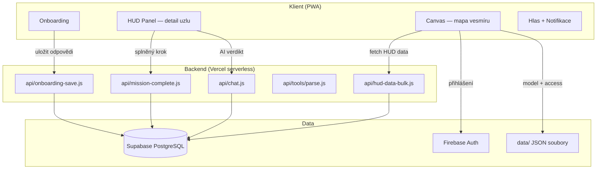
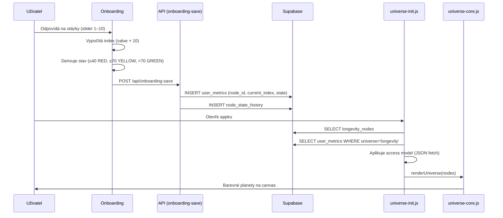
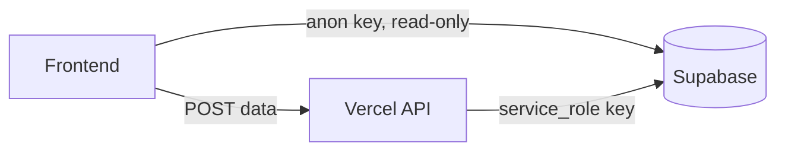
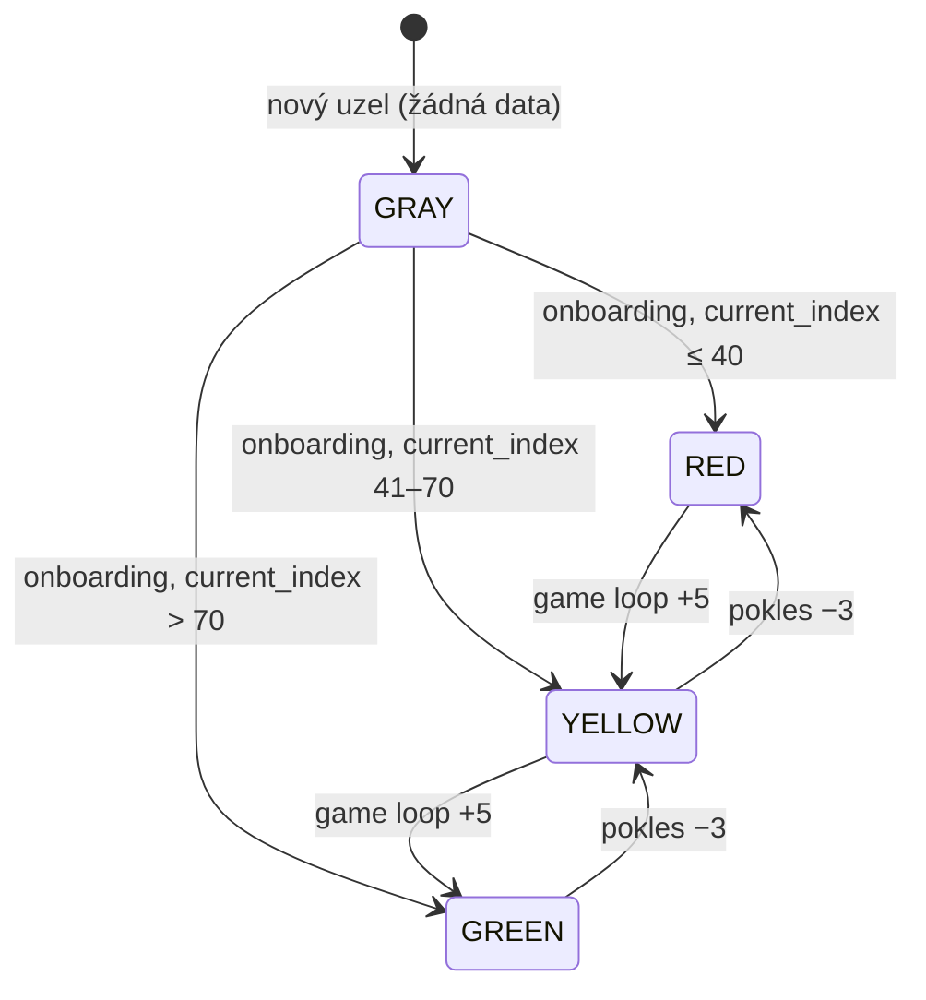
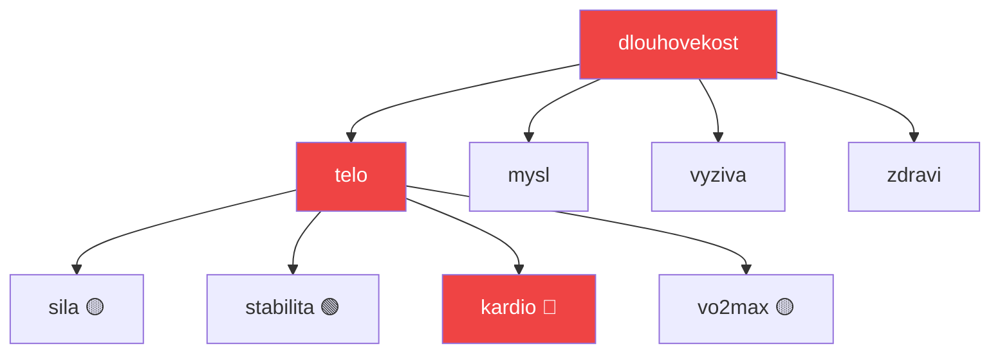
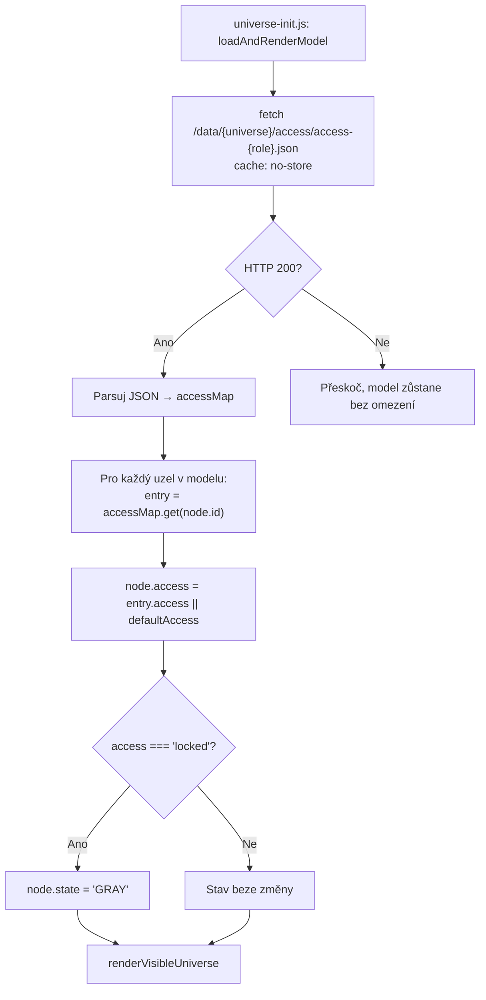
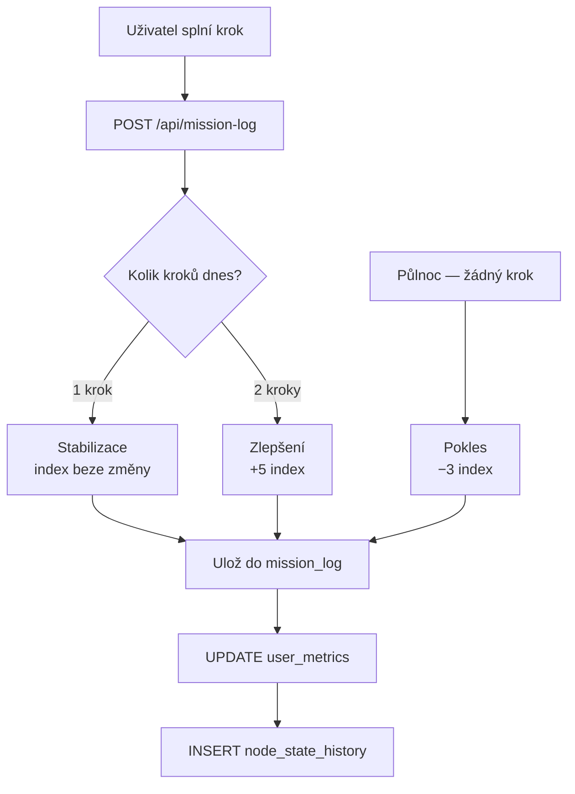
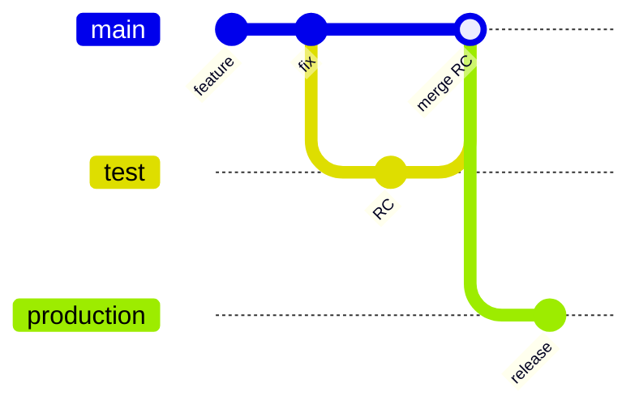

# CHJ Developer Handbook

> Technická dokumentace pro vývojáře a architekty.
> Pro instrukce Claudovi → `CLAUDE.md`
> Verze: v0.3.0 · Aktualizováno: 2026-06-05

---

## Obsah

1. [Produkt](#1-produkt)
2. [Architektura systému](#2-architektura-systému)
3. [Adresářová struktura](#3-adresářová-struktura)
4. [Jádro vs Obsah](#4-jádro-vs-obsah)
5. [Datový model](#5-datový-model)
6. [Stavový systém](#6-stavový-systém)
7. [Launcher a Bio-Vesmír](#7-launcher-a-bio-vesmír-v03)
8. [Access model a role](#8-access-model-a-role)
9. [Game Loop](#9-game-loop)
10. [Vesmíry](#10-vesmíry)
11. [API endpointy](#11-api-endpointy)
12. [Vývojový workflow](#12-vývojový-workflow)
13. [Pasti a anti-patterny](#13-pasti-a-anti-patterny)
14. [Roadmapa](#14-roadmapa)

---

## 1. Produkt

**Chytré Já (CHJ)** je mobilní PWA — AI kouč pro dlouhověkost postavený na principech Medicine 3.0 (Peter Attia, *Outlive*).

Klíčový princip: uživatel **nemusí hledat ani přemýšlet**. Appka vidí jeho stav, zná jeho cíle a říká mu co dělat a proč. Jedno klepnutí = splněný krok = změna v grafu.

**Tón:** kombinace osobního kouče a sci-fi HUD terminálu.
**Jazyk:** UI labels anglicky, obsah česky, tykání.
**Cíl:** SaaS, mobilní first, offline-capable PWA.

---

## 2. Architektura systému

### Tři vrstvy



### Datový tok — od onboardingu po canvas



### Stack

| Vrstva | Technologie | Verze |
|--------|-------------|-------|
| Frontend | Vanilla JS + HTML/CSS | ES2022+ |
| Canvas | vis.js network | 9.x |
| Backend | Vercel serverless (Node.js, ESM) | Node 18 |
| AI — chat | OpenAI GPT-4o-mini | latest |
| AI — parser | Claude Sonnet | claude-sonnet-4-5 |
| DB | Supabase (PostgreSQL) | |
| Auth | Firebase | 10.x |
| TTS | Web Speech API | browser native |
| Hosting | Vercel | |

---

## 3. Adresářová struktura

```
chytreja-app/
│
├── app/                            ← Frontend (PWA)
│   ├── index.html                  ← Hlavní vstupní bod
│   ├── hud.html                    ← HUD standalone (dekatlon)
│   ├── login.html
│   ├── css/
│   └── js/universe/
│       ├── universe-init.js        ← ⚠️ JÁDRO
│       ├── universe-core.js        ← ⚠️ JÁDRO
│       ├── universe-panel.js       ← HUD panel (detail uzlu)
│       ├── hud.js                  ← HUD inicializace
│       ├── onboarding.js           ← Onboardingové otázky + výpočet
│       ├── supabaseClient.js       ← Anon key (read-only)
│       ├── game-engine.js          ← Verdikty, killer texty
│       ├── skill-router.js         ← Výběr akce podle uzlu + constraints
│       ├── skills/
│       │   ├── cviceni.js          ← Cviky (Tělo)
│       │   ├── metabol.js          ← Metabolické akce
│       │   ├── prevence.js         ← Prevence, spánek
│       │   ├── mindset.js          ← Mysl, stres
│       │   └── vyziva.js           ← Výživa
│       ├── universe-voice.js       ← TTS + hlasový vstup
│       ├── notifications.js        ← Push notifikace
│       ├── medioteka.js            ← Mediální obsah
│       └── user-data-panel.js      ← Panel uživatelských dat
│
├── api/                            ← Backend (Vercel serverless, ESM)
│   ├── hud-data-bulk.js            ← ⚠️ JÁDRO: HUD data + baterie
│   ├── chat.js                     ← AI verdikt (GPT-4o-mini)
│   ├── mission-complete.js         ← Game loop výpočet
│   ├── mission-log.js              ← Záznam kroků
│   ├── onboarding-save.js          ← Uložení onboardingu (service_role)
│   ├── snapshot-nodes.js           ← Snapshot stavu uzlů
│   ├── aspiration.js               ← Aspirace gap výpočet
│   ├── readiness.js                ← Denní připravenost
│   ├── sources.js                  ← Zdroje pro uzly
│   ├── notify.js                   ← Push notifikace
│   ├── user-profile.js             ← Uživatelský profil
│   ├── orchestrator.js             ← CHJ orchestrátor (plán)
│   └── tools/
│       └── parse.js                ← Health Document Parser (Claude Vision)
│
├── data/                           ← Statická data (JSON)
│   ├── index.json                  ← Seznam vesmírů
│   └── universes/
│       ├── longevity/
│       │   ├── models/
│       │   │   └── longevity.json  ← Struktura uzlů vesmíru
│       │   ├── access/
│       │   │   ├── access-dekatlon.json  ← 9 fyzických disciplín
│       │   │   ├── access-lehkost.json   ← Hubnutí (kardio, vyziva, spanek, mysl)
│       │   │   ├── access-pro.json
│       │   │   ├── access-free.json
│       │   │   └── access-demo.json
│       │   └── assistants/
│       │       └── assistant-longevity.json
│       ├── toc/
│       │   └── models/toc.json
│       └── bmc/
│           └── models/bmc.json
│
├── migrations/                     ← SQL skripty (spouštět ručně v Supabase)
│   ├── add_plyometrie_node.sql
│   ├── seed_rovnovaha_dychani.sql
│   └── seed_plyometrie.sql
│
├── .githooks/
│   └── pre-push                    ← Syntax check + doc warning
│
├── CLAUDE.md                       ← Instrukce pro Claude Code
├── HANDBOOK.md                     ← Tato dokumentace
└── vercel.json                     ← Routing + cache headers
```

---

## 4. Jádro vs Obsah

### ⚠️ Jádro — vysoké riziko, testovat před každou změnou

| Soubor | Zodpovědnost | Riziko změny |
|--------|-------------|--------------|
| `app/js/universe/universe-init.js` | Načítání modelu, access model, kaskáda stavů, render | Canvas se nespustí |
| `app/js/universe/universe-core.js` | vis.js rendering, barvy uzlů, lock ikony | Vizuální rozpad |
| `api/hud-data-bulk.js` | Výpočet baterie, worstLeaf, killer | HUD panel prázdný |

**Protokol před změnou jádra:**
1. Napiš repro scénář: *"Přejdu na dev.iting.cz, přihlásím se jako dekatlon, očekávám X"*
2. Udělej jednu změnu — ne pět najednou
3. Push → ověř na dev.iting.cz
4. Aktualizuj HANDBOOK.md ve stejném commitu

### ✅ Obsah — bezpečná zóna

| Soubor/složka | Co dělá |
|---------------|---------|
| `data/universes/*/access/*.json` | Kdo vidí co (role access maps) |
| `app/js/universe/onboarding.js` | Onboardingové otázky a mapování |
| `data/universes/*/models/*.json` | Struktura uzlů vesmíru |
| `app/js/universe/skills/*.js` | Výběr akcí (deterministická logika) |
| `migrations/*.sql` | DB změny |

---

## 5. Datový model

### Aktivní tabulky

| Tabulka | Klíčové sloupce | Popis |
|---------|----------------|-------|
| `longevity_nodes` | id, label, parent, default_priority | Strom uzlů vesmíru |
| `user_metrics` | user_id, node_id, current_index, state, universe | Aktuální stav uzlu |
| `node_state_history` | user_id, node_id, current_index, recorded_at | 30denní sparkline |
| `mission_log` | user_id, node_id, mission_id, date, action_type | Splněné kroky |
| `user_aspirations` | user_id, aspiration_type | Uživatelský sen |
| `aspiration_requirements` | aspiration_type, node_id, required_level, importance_weight | Co sen vyžaduje |
| `user_decathlon` | user_id, goal_key, label, target_age, priority, pillar_weights | Osobní Dekaton cíle s vahami disciplín |
| `user_constraints` | user_id, type, description, active | Zdravotní omezení |
| `node_inputs` | user_id, node_id, source, raw_data | Audit vstupů |
| `user_profiles` | user_id, ... | Uživatelský profil |
| `ai_conversations` | user_id, node_id, messages | Historie AI chatu |
| `onboarding_questions` | id, node_id, question, type | Onboardingové otázky (v DB, zatím nevyužito — základ pro admin panel) |
| `toc_hlavni_plan` | — | TOC hlavní plán (KPI) |
| `toc_zakazky` | — | TOC zakázky |
| `toc_parametry` | — | TOC parametry |
| `toc_pracoviste` | — | TOC pracoviště |

### Osobní datová vrstva (v0.3) — `migrations/v03_personal_data_layer.sql`

Čistě aditivní migrace (ADD COLUMN IF NOT EXISTS + nové tabulky). Nic se nemaže.

**Rozšířené existující tabulky:**

| Tabulka | Nové sloupce |
|---------|-------------|
| `user_supplements` | `form`, `frequency`, `reason`, `lab_marker`, `notes`, `updated_at` |
| `user_medications` | `timing`, `frequency`, `condition`, `start_date`, `end_date`, `prescribed`, `notes`, `updated_at` |
| `user_lab_results` | `status` (GENERATED: LOW/NORMAL/HIGH/CRITICAL), `lab_name`, `doc_ref`, `updated_at` |
| `user_biometrics` | `muscle_mass_kg`, `bone_density`, `hrv_ms`, `resting_hr`, `vo2max`, `updated_at` |

**Nové tabulky:**

| Tabulka | Popis |
|---------|-------|
| `user_meals` | Tracking jídel (popis, foto_url, kcal, protein_g, carbs_g, fat_g, source) |
| `user_daily_log` | Denní souhrn (kcal, protein, kroky, spánek, HRV, váha) — UNIQUE (user_id, log_date) |
| `user_notification_schedule` | Plán proaktivních notifikací (trigger_type, time_of_day, days_of_week, message) |

**Klíčová logika:**
- `user_lab_results.status` je computed column — automaticky LOW/NORMAL/HIGH podle `value` vs `reference_min/max`
- `user_supplements.end_date = null` → aktivní / chronické; `end_date` nastavené → ukončený suplement
- `user_supplements.lab_marker` → propojení suplementu s lab výsledkem (např. Mg → marker 'Mg')

### Tabulky pro v0.4+ (Health Parser)

| Tabulka | Popis |
|---------|-------|
| `user_lab_results` | Výsledky krevních testů (179 řádků) |
| `user_medications` | Léky uživatele |
| `user_supplements` | Suplementy |
| `user_fitness_tests` | Výsledky fitness testů |
| `user_biometrics` | Biometrická data |
| `vitality_score_history` | Historie vitality skóre |

### Legacy tabulky (nepsat, pouze číst)

| Tabulka | Popis |
|---------|-------|
| `nodes` | Starší verze longevity_nodes — bohatší obsah (definition, icon) |
| `universe_nodes` | Duplikát nodes — zachováno kvůli FK |
| `knowledge_nodes` | Duplikát nodes |
| `universes` | Zachováno kvůli FK na universe_nodes |

### Views

| View | Popis |
|------|-------|
| `v_discipline_states` | Agregovaný stav disciplín pod Tělem |
| `user_bottlenecks` | Ranking uzlů podle bottleneck skóre |
| `v_vitality_dashboard` | Vitality dashboard přehled |

### Bezpečnost (Security model)



- Frontend používá **anon klíč** — žádné přímé zápisy
- Všechny zápisy jdou přes API endpointy (service_role na serveru)
- RLS migrace: `migrations/20260429_enable_rls.sql` — **PENDING**

---

## 6. Stavový systém

### Index → Stav (single source of truth)



| Index | Stav | Barva |
|-------|------|-------|
| 0 | GRAY | šedá (žádná data) |
| 1–40 | RED | červená |
| 41–70 | YELLOW | žlutá |
| 71–100 | GREEN | zelená |

**GRAY ≠ LOCKED.** Kritická distinkce:
- `state = GRAY` → uzel bez dat, uživatel k němu přístup má → klik otevře HUD panel (prázdný)
- `access = 'locked'` → záměrně uzamčeno rolí → zobrazí 🔒 → klik otevře **locked preview** ("🔒 Připravujeme pro tebe")

### showPanel() — interní větvení

`showPanel(node)` v `universe-panel.js` rozhoduje sama:
- `node.access !== 'locked'` → normální HUD (baterie, killer, akce)
- `node.access === 'locked'` → volá `showLockedPanel(node)` → zobrazí preview z `DEMO_PREVIEWS`

**Anti-pattern:** nikdy neguardovat klik v `universe-core.js` na `access !== 'locked'` — zablokuje to locked preview zprávu. Správné místo pro větvení je uvnitř `showPanel()`.

### Kaskáda na parent uzly (worstLeaf)



Parent uzly berou barvu **nejhoršího potomka** na všech úrovních (worstLeaf, ne worstChild).
`worstLeaf` je implementován v `api/hud-data-bulk.js`.

---

## 7. Launcher a Bio-Vesmír (v0.3)

### Filozofie

Launcher je **Zero-UI shell** — nebula čeká, uživatel iniciuje. Žádný automatický briefing.

```
Tap → showAwake() + STT spustí hned
Hlas → tryRoute() → "co dál?" / specifický povel / fallback AI
```

### Bio-Vesmír — Single Source of Truth

Launcher vždy načítá bio data z `dlouhovekost/longevity` bez ohledu na aktivní model.

```js
// launcher.js — loadBioData()
const url = `/api/hud-data-bulk?nodes=dlouhovekost&userId=${userId}&universe=longevity`;
```

### "Co dál?" router (bottleneck-first)

```
fetchBottleneck(userId, role)
  1. user_bottlenecks view (aspiration-weighted)
  2. fallback: nejhorší RED/YELLOW uzel z user_metrics
     - role=dekatlon → filtr na dekatlon uzly
     - role=lehkost → filtr na longevity uzly (vyziva, kardio, spanek, mysl)

generateRecommendText(context)
  → getUniverseContext(role) → AI prompt s bottleneckem + cílem
  → 1–2 věty, max 25 slov, bottleneck jménem
```

### STT chování

- Tap → `showAwake()` + `listenOnce()` v jednom
- `no-speech` → `onend` handler restartuje automaticky (dokud phase=awake)
- Mic zůstane viditelný i po timeoutu

---

## 8. Access model a role

### Role

| Role | Model (canvas) | Produkt (uživatel vidí) | defaultAccess |
|------|---------------|------------------------|---------------|
| `longevity` | longevity | Dlouhověkost (plný přístup) | `visible` |
| `dekatlon` | longevity | Dekatlon | `locked` |
| `lehkost` | longevity | Hubnutí | `locked` |
| `pro` | libovolný | — | `visible` |
| `free` | libovolný | — | `locked` |
| `demo` | libovolný | Demo | `locked` |

**Důležité:** `dekatlon` a `lehkost` jsou **filtry/pohledy na longevity model** — ne samostatné vesmíry. Sdílejí stejný canvas, stejné uzly, stejnou `user_metrics` tabulku s `universe='longevity'`.

**Mapování lehkost → longevity uzly:**

| Lehkost oblast | Longevity uzel | Label override |
|----------------|---------------|---------------|
| Pohyb | `kardio` | "Pohyb" |
| Výživa | `vyziva` | — |
| Regenerace | `spanek` | "Regenerace" |
| Mysl | `mysl` | — |
| Hlavní | `dlouhovekost` | "Hra o hubnutí" |

### Jak access model funguje



### Access JSON formát

```json
[
  { "id": "dlouhovekost", "access": "full", "label": "Vlastní label" },
  { "id": "telo",         "access": "full" },
  { "id": "mysl",         "access": "locked" }
]
```

Uzly **neuvedené** v souboru → `defaultAccess` podle role.

### Jak přidat novou roli

1. Vytvoř `data/universes/{vesmír}/access/access-{role}.json`
2. Přidej roli do `defaultAccess` podmínky v `universe-init.js` (bezpečná změna)
3. Nastav `primary_goal` uživateli v DB na novou roli

### Dekaton — 10 disciplín

| Uzel | Disciplína | Onboarding otázka(y) |
|------|-----------|---------------------|
| `sila` | Síla | vynest_nakup, zvednout_vnouce, otevrit_zavarovacku |
| `stabilita` | Stabilita | vstat_ze_zeme, balanc_jedna_noha |
| `vo2max` | VO2max | vyjit_4_patra |
| `kardio` | Kardio | — (data z vo2max/vytrvalost) |
| `mobilita` | Mobilita | kufr_do_police |
| `vytrvalost` | Vytrvalost | rychla_chuze |
| `rovnovaha` | Rovnováha | rovnovaha_zavrene_oci |
| `plyometrie` | Plyometrie | skocit_dopadnout |
| `dychani` | Dýchání | zadrzeni_dechu |

---

## 8. Game Loop



### Pravidla

- Max **2 kroky/den** na uzel
- Rolling **7denní okno** (ne pondělní reset)
- Pokles nastane **další den** po dni bez aktivity

### Druhá akce (smart offer)

| Stav | Trend | Nabídka |
|------|-------|---------|
| RED | DOWN | Vždy: *"Můžeš to ještě posílit."* |
| YELLOW | STABLE | 50/50 šance |
| GREEN | UP | *"Držíš to. Dnes stačí."* |
| streak ≥ 3 | — | Boost: *"Jedeš dobře. Přidáš krok?"* |

Druhá akce = jiná mise ze **stejného uzlu**.

---

## 9. Vesmíry

### Jak vesmír funguje

```mermaid
graph LR
    IDX[data/index.json] -->|seznam vesmírů| INIT[universe-init.js]
    INIT -->|useSupabase: true| DB[(Supabase longevity_nodes)]
    INIT -->|useSupabase: false| JSON[models/model.json]
    INIT --> ACCESS[access/access-{role}.json]
    INIT --> RENDER[renderUniverse]
```

`data/index.json` je registr. Klíč = `modelName`, použitý v URL (`/data/universes/{modelName}/`).

### Existující vesmíry

| ID | Label | Backend | Status |
|----|-------|---------|--------|
| `longevity` | Dlouhověkost | Supabase | ✅ Aktivní |
| `toc` | TOC | JSON | 🔄 Vývoj |
| `bmc` | BMC | JSON | 📋 Plán |

### Jak přidat nový vesmír

1. Vytvoř `data/universes/{id}/models/{id}.json`
2. Vytvoř `data/universes/{id}/access/access-{role}.json` pro každou roli
3. Přidej záznam do `data/index.json`
4. Pokud Supabase: přidej uzly do příslušné tabulky uzlů

---

## 10. API endpointy

| Endpoint | Metoda | Auth | Popis |
|----------|--------|------|-------|
| `/api/hud-data-bulk` | POST | Firebase UID | HUD data — baterie, killer, akce, zdroje |
| `/api/chat` | POST | Firebase UID | AI verdikt (GPT-4o-mini) |
| `/api/mission-log` | POST | Firebase UID | Uložit splněný krok |
| `/api/mission-complete` | POST | Firebase UID | Game loop — stabilize/improve/decline |
| `/api/onboarding-save` | POST | Firebase UID | Uložit výsledky onboardingu |
| `/api/snapshot-nodes` | POST | Firebase UID | Snapshot stavu uzlů |
| `/api/aspiration` | GET | Firebase UID | Aspirace gap |
| `/api/readiness` | GET | Firebase UID | Denní připravenost |
| `/api/sources` | GET | — | Zdroje pro uzel |
| `/api/user-profile` | GET/POST | Firebase UID | Uživatelský profil |
| `/api/tools/parse` | POST | Firebase UID | Health Document Parser (Claude Vision) |

### Konvence serverless funkcí

```js
import dotenv from 'dotenv';
dotenv.config({ path: '.env.local' }); // nutné na Windows

export default async function handler(req, res) {
  // Supabase client UVNITŘ handleru (env vars nejsou dostupné na top-level)
  const { createClient } = await import('@supabase/supabase-js');
  const supabase = createClient(
    process.env.SUPABASE_URL,
    process.env.SUPABASE_SERVICE_ROLE_KEY
  );
  // ...
}
```

---

## 11. Vývojový workflow

### Prostředí

| Branch | URL | Použití |
|--------|-----|---------|
| `main` | dev.iting.cz | Aktivní vývoj |
| `test` | test.iting.cz | Testování před release |
| `production` | app.iting.cz | Produkce |
| `demo` | demo.iting.cz | Demo pro nové uživatele |

### Git workflow



1. Vývoj na `main` → automatický deploy na `dev.iting.cz`
2. Testování na `test` větvi → `test.iting.cz`
3. Release: merge do `production` → `app.iting.cz`

### Migrace (SQL)

Každá DB změna = SQL soubor v `/migrations/`.

```
migrations/
├── add_plyometrie_node.sql        ← Přidání uzlu
├── seed_rovnovaha_dychani.sql     ← Seed dat pro existující uživatele
└── seed_plyometrie.sql            ← Insert chybějících metrik
```

**Postup:**
1. Napiš SQL skript s komentářem (co dělá, proč je bezpečný)
2. Commitni do repozitáře
3. Spusť ručně v Supabase SQL Editoru
4. Označ v komentáři souboru datum spuštění

### Pre-push hook

Automaticky spouští:
1. **Syntax check** jádra (`universe-init.js`, `universe-core.js`, `hud-data-bulk.js`) → **blokuje push**
2. **Varování** pokud se jádro změnilo bez aktualizace HANDBOOK.md → pouze upozorní

Instalace (jednorázová): `git config core.hooksPath .githooks`

### Env proměnné

```
OPENAI_API_KEY          ← GPT-4o-mini
ANTHROPIC_API_KEY       ← Claude Sonnet (health parser)
SUPABASE_URL
SUPABASE_SERVICE_ROLE_KEY   ← jen na serveru
AI_ENABLED=true
```

Lokálně: `.env.local` — nikdy necommitovat.

---

## 12. Pasti a anti-patterny

### 🔴 GRAY ≠ LOCKED

**Problém:** Lock ikona se kreslila na všechny uzly se stavem GRAY.
**Příčina:** `state = GRAY` má dvě příčiny — žádná data vs. záměrné zamčení rolí.
**Řešení:** Lock ikona jen na `access === 'locked'`. GRAY bez locku = uzel bez dat.

```js
// ❌ Špatně
source.filter(n => n.state === 'GRAY')

// ✅ Správně
source.filter(n => n.access === 'locked')
```

---

### 🔴 Inline duplikát access modelu

**Problém:** CDN cachoval starý access JSON → uzly stále zamčené i po aktualizaci souboru.
**Pokušení:** Inlinovat data přímo do JS (`INLINE_ACCESS` konstanta).
**Proč je to špatné:** Dvě místa = divergence → budoucí bugy.
**Správné řešení:** Opravit caching (`cache: 'no-store'` + `vercel.json` `no-cache` hlavičky). JSON soubory jsou single source of truth.

---

### 🔴 worstChild vs worstLeaf

**Problém:** Baterie uzlu `telo` ukazovala 5% i když disciplíny byly zdravé.
**Příčina:** `worstChild` četl stale hodnotu `telo.current_index = 5` z DB místo pohledu na skutečné potomky.
**Řešení:** `worstLeaf` — kaskáda až na listy (disciplíny), ignoruje intermediate parent uzly.

```
❌ worstChild: telo → [telo.index=5] → baterie 5%
✅ worstLeaf:  telo → [sila, stabilita, vo2max...] → baterie z reálných dat
```

---

### 🔴 Jedna změna = pět commitů

**Problém:** Dnešní session přidala no-cache headers, cache-bust param, no-store fetch, INLINE_ACCESS a syntax fix — vše najednou. Nebylo jasné co pomohlo a co rozbilo.
**Pravidlo:** Jedna hypotéza = jedna změna = jeden commit. Ověř před dalším krokem.

---

### 🟡 Supabase client na top-level

**Problém:** `createClient()` volaný na top-level serverless funkce — env vars nejsou dostupné při importu.
**Řešení:** Vždy vytvořit klienta uvnitř `handler()` funkce.

---

### 🟡 worstChild zahrnoval uzly s index=0

**Problém:** Nové uzly bez metrik (index=0) táhly baterii na nulu.
**Řešení:** Filtrovat `current_index > 0` nebo použít worstLeaf.

---

### 🔴 Dvě paralelní CRT generování — Opus dynamický vs. statický v2 KB

**Problém:** V repu existují dvě nezávislé cesty, jak se sestaví Kauzální mapa (`app/crt.html`):

1. **`api/crt-generate.js`** — Opus (`claude-opus-4-8`) dynamicky generuje strom z reálných dat uživatele (diagnózy, léky, labs) přes strukturovaný prompt, včetně `medications_map` (treatment/protects/warning). Aktivně vyvíjeno do 19.6.2026. Spouští se přes `?opus=1`.
2. **`data/crt/v2/*.json`** (`biosystem_v2.json`, `kardio_story.json`, ...) — ručně psané KB soubory s `condition` pravidly, vykreslované přes `loadCRT()` v `crt.html`. Tohle je **default** (bez `?opus=1`).

**Příčina:** Pravděpodobně ztracený kontext mezi sessions (ne záměrný architektonický rozhodnutí) — vznikly vedle sebe, nikdo to nesjednotil.

**Stav k 30.6.2026:** Opus cesta (`?opus=1`) se vykreslí, ale layout je nepoužitelný. v2 statický systém je funkční a aktivně laděný (barycenter layout, pill rendering, lékové kolize).

**Pravidlo:** v2 statický systém (`data/crt/v2/`) je teď primární. Než se znovu sáhne na Opus cestu, je potřeba ji buď opravit, nebo `api/crt-generate.js` + `loadCRTOpus` v `crt.html` jako mrtvý kód odstranit — ne nechat ležet jako nejasnou druhou pravdu.

---

## 13. Roadmapa

| Verze | Obsah | Status |
|-------|-------|--------|
| v0.1.0 | Semafor, kroky, baterie, onboarding (vanilla JS) | ✅ |
| v0.2.0 | HUD panel, vícero vesmírů, Dekaton základy | ✅ |
| v0.2.1 | Dekaton 10 disciplín, access model cleanup | ✅ `git tag v0.2.1-dekatlon-working` |
| v0.3.0 | Claude Haiku pro výběr kroků + personalizace | 📋 |
| v0.4.0 | Health Document Parser (krev, EKG) + foto jídel | 📋 |
| v0.5.0 | CHJ Master Agent + MCP orchestrace | 📋 |
| v0.6.0 | Push notifikace + ranní briefing | 📋 |
| v1.0.0 | SaaS launch — platební brána + landing | 📋 |

---

*Aktualizovat při každé změně jádra nebo architektury.*
